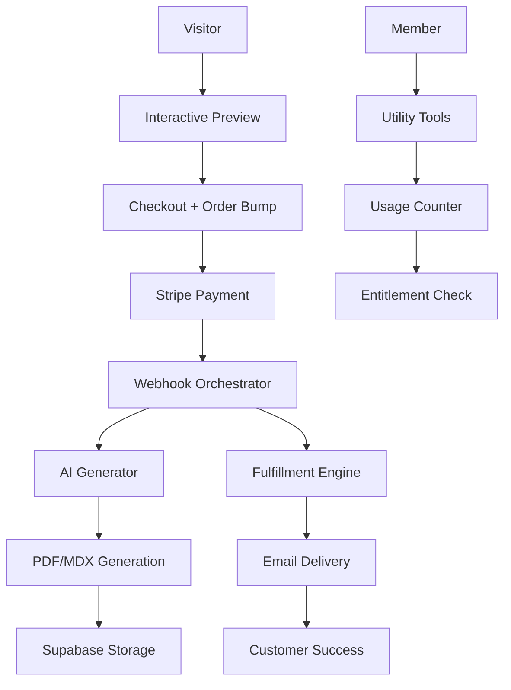

# peycheff.com v2

> **Linear-grade, zero-time monetization engine**

**Project Status:** Ready for build  
**Owner:** Ivan Peychev (founder & systems designer)  
**Objective:** Fully automated premium personal site that converts attention into revenue without calls or custom work

This is the complete source code for [peycheff.com](https://peycheff.com) v2 — a sophisticated monetization engine that transforms top-of-funnel attention into instant digital product sales through AI-powered generators, automated content systems, and programmatic SEO.

## 🎯 Mission

**Turn every visitor into revenue through automated digital experiences.**

peycheff.com v2 eliminates the traditional consulting bottleneck by delivering instant value through:

- **AI-powered generators** that create personalized sprint plans and system audits in minutes
- **Automated digital products** with instant delivery (no calls, no custom work)
- **Programmatic content systems** that scale SEO and compound growth
- **Interactive conversion tools** that remove buyer friction and doubt
- **Membership utilities** that create recurring revenue through useful tools

### Core Philosophy

**Constraints create clarity. Automation enables scale. Every interface serves conversion.**

This isn't just a website—it's a revenue-generating system. Every visual element, interaction, and backend process is designed around one metric: Revenue per Visitor (R/V).

### Success Metrics (North Stars)

- **Revenue/Visitor:** ≥$0.60 (30 days) → ≥$1.20 (90 days)
- **Order Bump Attach Rate:** ≥12% within two weeks  
- **Trial→Paid Conversion:** ≥25% within 30 days (Utility Pass)
- **Monthly Recurring Revenue:** $1.5k (60 days) → $4k (120 days)
- **Performance:** LCP <1.8s, CLS <0.05, INP <200ms (mobile p95)
- **Content Automation:** 2 Notes/month shipped with zero manual edits

## 💰 Monetization Engine (v2)

**Zero-time revenue through instant digital delivery. No calls, no custom work.**

### Core Product Lineup

| Product | Code | Price | Delivery | Description |
|---------|------|--------|----------|-------------|
| **Auto-Sprint Plan** | `SPRINT_GEN` | $49 | PDF+MDX+Cheat | 60-second intake → personalized plan in minutes |
| **Auto-Audit Pro** | `AUDIT_PRO` | $99 | PDF+Report | URL teardown with Impact×Effort matrix + 7-day cadence |
| **Utility Pass** | `UTIL_PASS` | $12/mo | Gated Tools | 7-day free trial with usage caps |
| **Agent Kit Bundle** | `AGENT_BUNDLE` | $79 | ZIP Package | n8n/MCP templates with ready-to-run flows |
| **Operator Pack** | `OP_PACK` | $39 | PDF/MDX | Static 30-day system framework |
| **Micro-Automation Kit** | `KIT_*` | $29 | ZIP Package | Single automation playbook (upsell from Notes) |

### Membership Tiers

| Tier | Code | Price | Benefits |
|------|------|-------|----------|
| **Build Notes (Base)** | `MEMBER` | $9/mo or $90/yr | 2 memos/month + 50% off Packs/Kits |
| **Build Notes (Pro)** | `MEMBER_PRO` | $29/mo | Base + unlimited re-gens + Pro utilities |

### Premium Bundles

| Bundle | Code | Price | Contents | Savings |
|--------|------|-------|----------|----------|
| **Founder Pack** | `FOUNDER_PACK` | $149 | Sprint + Audit + OP + 1mo Utility | Hidden upsell post-purchase |

### Conversion Mechanisms

- **Order Bump:** "Add Auto-Audit Pro for $69 (save $30)" at checkout
- **Upsell Flow:** Post-purchase Founder Pack upgrade ($149) 
- **Trial Funnel:** 7-day Utility Pass trial → 25% conversion target
- **Interactive Preview:** 30-second sprint preview removes buying friction

### Revenue Targets

- **Revenue per Visitor:** $0.60 (30 days) → $1.20 (90 days)
- **Order Bump Attach Rate:** ≥12% within two weeks
- **MRR Growth:** $1.5k (60 days) → $4k (120 days)
- **Trial Conversion:** ≥25% (Utility Pass trial → paid)

## ⚡ Tech Stack

**Frontend:**
- **React 18** with modern hooks and Suspense
- **Vite** for blazing-fast development (custom port 4028)
- **Tailwind CSS** with locked design system
- **Framer Motion** for 120-160ms micro-interactions
- **React Router DOM 6** for client-side routing

**Backend Services:**
- **Netlify Functions** (23 deployed serverless functions)
- **Supabase** for database (subscribers, inquiries, user analytics)
- **Stripe** for payments (17 different products/price tiers)
- **Resend** for transactional emails (welcome, receipts, notifications)
- **OpenAI** for AI utilities (GPT-4 for content generation)
- **Puppeteer** for PDF generation and page automation

**Infrastructure:**
- **Netlify** for hosting with automatic SSL
- **Google Analytics 4** for behavioral tracking
- **Environment-based deployments** with comprehensive env var management

## 🚀 Quick Start

```bash
# Install dependencies
npm install

# Copy environment template
cp .env.example .env

# Start development server (runs on port 4028)
npm start

# Build for production
npm run build

# Preview production build
npm run serve
```

## 🛠️ Environment Setup

### Client-side Variables (Required)

```bash
# Database
VITE_SUPABASE_URL=your-supabase-url
VITE_SUPABASE_ANON_KEY=your-supabase-key

# Payments  
VITE_STRIPE_PUBLISHABLE_KEY=your-stripe-key

# Analytics
VITE_GA_MEASUREMENT_ID=your-ga4-id
```

### Serverless Function Variables (Backend)

```bash
# Email service
RESEND_API_KEY=re_your_api_key_here

# Payment processing
STRIPE_SECRET_KEY=sk_your_secret_key_here
STRIPE_WEBHOOK_SECRET=whsec_your_webhook_secret_here

# Database (service role)
SUPABASE_URL=your-supabase-url
SUPABASE_SERVICE_ROLE_KEY=your-service-role-key

# AI services
OPENAI_API_KEY=sk-your-openai-key
```

## 🏗️ System Architecture

### Core System Flows



### Data Model (Supabase)

```sql
-- v2 Data Architecture
CREATE TABLE customers(
  id UUID PRIMARY KEY DEFAULT gen_random_uuid(),
  email TEXT UNIQUE NOT NULL,
  name TEXT, 
  handle TEXT,
  created_at TIMESTAMPTZ DEFAULT NOW()
);

CREATE TABLE orders(
  id UUID PRIMARY KEY DEFAULT gen_random_uuid(),
  stripe_event_id TEXT UNIQUE NOT NULL,
  email TEXT NOT NULL REFERENCES customers(email) ON DELETE CASCADE,
  sku TEXT NOT NULL,
  amount_cents INT NOT NULL,
  currency TEXT DEFAULT 'usd',
  source TEXT, -- UTM/campaign tracking
  created_at TIMESTAMPTZ DEFAULT NOW()
);

CREATE TABLE entitlements(
  id UUID PRIMARY KEY DEFAULT gen_random_uuid(),
  email TEXT NOT NULL REFERENCES customers(email) ON DELETE CASCADE,
  sku TEXT NOT NULL,
  expires_at TIMESTAMPTZ,
  created_at TIMESTAMPTZ DEFAULT NOW()
);

CREATE TABLE downloads(
  id UUID PRIMARY KEY DEFAULT gen_random_uuid(),
  email TEXT NOT NULL REFERENCES customers(email) ON DELETE CASCADE,
  sku TEXT NOT NULL,
  file_path TEXT NOT NULL,
  token TEXT NOT NULL,
  expires_at TIMESTAMPTZ NOT NULL,
  created_at TIMESTAMPTZ DEFAULT NOW()
);

CREATE TABLE usage_counters(
  email TEXT NOT NULL REFERENCES customers(email) ON DELETE CASCADE,
  sku TEXT NOT NULL,
  window_start TIMESTAMPTZ NOT NULL,
  runs INT NOT NULL DEFAULT 0,
  PRIMARY KEY (email, sku, window_start)
);

-- RLS enabled; service role for writes; downloads selectable only by owner
```

### API Contracts

#### Core Generators

```typescript
// Sprint Plan Preview (Hero)
POST /api/preview/sprint
Request: { goal: string, stack: string }
Response: { 
  week1: [{ day: "Mon", tasks: string[] }, ...], 
  watermark: true 
}

// Full Sprint Plan Generation
POST /api/generate/sprint
Request: { 
  goal: string, 
  team: 'solo'|'2-3'|'4-6', 
  stack: string, 
  deadline: '30d'|'45d' 
}
Response: { 
  pdfUrl: string, 
  mdxUrl: string, 
  cheatUrl: string 
}

// System Audit Generation
POST /api/generate/audit
Request: { 
  url: string, 
  niche: string, 
  goal: 'leads'|'sales'|'signup' 
}
Response: { 
  pdfUrl: string, 
  reportUrl: string // /r/:id shareable link
}
```

#### Utility Tools

```typescript
// Note to Social Threads
POST /api/tools/threadify
Request: { noteMdx: string }
Response: { 
  linkedin: string[], 
  x: string[], 
  slides: string[] 
}

// UTM Link Manager
POST /api/tools/utm-memory
Request: { url: string, campaign: string, medium: string }
Response: { shortUrl: string, trackingId: string }

// Pricing Heuristic
POST /api/tools/price-estimate
Request: { scope: string, risk: string, timeline: string }
Response: { bands: { low: number, mid: number, high: number } }
```

#### Payment & Fulfillment

```typescript
// Stripe Webhook Handler
POST /api/stripe/webhook
Request: Stripe Event JSON
Response: 200 (idempotent processing)
// Writes: orders, entitlements, dispatches fulfillment jobs

// Entitlement Checks
GET /api/entitlements/check?email=&sku=
Response: { hasAccess: boolean, usage: object }

// Shareable Reports
GET /r/:id
Response: Watermarked audit view with "Run your audit" CTA
// Headers: noindex until sufficient volume
```

### Frontend Architecture

```
src/
├── components/              # Reusable UI components
│   ├── layout/             # Header, Footer, Layout, NowBar
│   ├── ui/                 # Form components, buttons, inputs
│   ├── generators/         # Interactive preview, order bump
│   ├── tools/              # Utility Pass gated tools
│   └── SEO.jsx             # Structured data & meta tags
├── pages/                  # Route components + programmatic pages
│   ├── home/               # Linear narrative homepage
│   ├── tools/              # Tools landing + individual utilities
│   ├── notes/              # Auto-published content hub
│   ├── work/               # Portfolio showcase
│   ├── about/              # Founder story
│   └── programmatic/       # Role × Stack × Niche matrix (200-500 pages)
├── lib/                    # Service integrations
│   ├── supabase.js         # Database client with RLS helpers
│   ├── stripe.js           # Payment processing (new SKU lineup)
│   ├── analytics.js        # GA4 + conversion tracking
│   ├── experiments.js      # A/B testing framework
│   ├── ai.js              # OpenAI integration helpers
│   └── recommendations.js  # Next-best-action engine
├── utils/                  # Shared utilities
│   ├── cn.js              # Tailwind class merging
│   ├── animations.js       # Motion variants (reduced-motion aware)
│   └── constants.js        # SKU codes, pricing, limits
└── hooks/                  # Custom React hooks
    ├── useEntitlements.js  # Membership access checks
    ├── useUsageCounter.js  # Trial/Pro usage tracking
    └── useExperiments.js   # A/B test variant selection
```

### Backend Architecture (Serverless)

```
netlify/
└── functions/
    ├── generators/
    │   ├── preview-sprint.js     # 30-second hero preview
    │   ├── generate-sprint.js    # Full sprint plan (PDF/MDX/cheat)
    │   └── generate-audit.js     # System audit with shareable reports
    ├── tools/
    │   ├── threadify.js          # Note → social threads
    │   ├── utm-memory.js         # Link tracking manager
    │   ├── price-estimate.js     # Pricing heuristics
    │   ├── headline-variants.js  # H1 optimization
    │   └── brief-forge.js        # Scope → brief generator
    ├── payment/
    │   ├── stripe-webhook.js     # Idempotent webhook orchestrator
    │   └── fulfillment.js        # Download link generation
    ├── content/
    │   ├── autopublish-note.js   # 2/month automated publishing
    │   └── distribute-threads.js # Auto-generate social content
    ├── api/
    │   ├── entitlements.js       # Membership access gates
    │   ├── recommendations.js    # Next-best-action suggestions
    │   └── analytics.js          # Custom event tracking
    └── lib/
        ├── supabase-service.js   # Server-side database operations
        ├── openai-service.js     # AI generation with cost governance
        ├── email-service.js      # Resend templates (receipts, downloads)
        ├── pdf-service.js        # Puppeteer PDF generation
        └── storage-service.js    # File upload/signing for downloads
```

## 🎨 Design System

**Locked Visual System — No Compromises**

Every visual decision is intentionally constrained to maintain focus and prevent design debt:

### Typography
- **Font Stack:** SF Pro Display → Segoe UI → system-ui → sans-serif
- **Scale:** Fluid typography with 5 size tiers (text-h1 through text-body)
- **Line Heights:** 1.1 for headings, 1.6 for body text
- **Font Weights:** Regular (400) and Semibold (600) only

### Color Palette
```css
--background: #0B0C0F     /* Primary surface */
--surface: #0F1115        /* Cards, elevated content */
--border: #1A1D23         /* Subtle divisions */
--foreground: #F2F3F5     /* Primary text */
--text-secondary: #E1E3E7 /* Secondary text */
--text-tertiary: #A5ABB3  /* Muted text */
--accent: #0A84FF         /* Links, primary CTAs, focus states */
--input: #15171C          /* Form field backgrounds */
```

### Layout System
- **Container:** max-width 1080px with responsive padding
- **Grid:** CSS Grid with 12-column system
- **Spacing:** 8px baseline grid (rem-based)
- **Breakpoints:** Mobile-first with md (768px) and lg (1024px)

### Motion Design
- **Timing:** 120-160ms for micro-interactions, 300-600ms for page transitions
- **Easing:** `ease-out` for entrances, `ease-in-out` for state changes
- **Properties:** opacity, transform (translate/scale) only
- **Accessibility:** Respects `prefers-reduced-motion`

### Component Patterns
- **Cards:** `surface` background with subtle border and backdrop-blur
- **Buttons:** Primary (accent), secondary (border), ghost (transparent)
- **Forms:** Consistent focus states, proper ARIA labels
- **Loading States:** Skeleton screens and progress indicators

**Design Philosophy:** 
Constraints create clarity. The locked system eliminates decision fatigue and ensures every interface element serves the core goal: converting attention into meaningful business conversations.

## 🔑 Key Features

### 1. Interactive Sprint Preview (Hero)
- **Goal:** Remove doubt, accelerate first click
- **Flow:** Goal + Stack inputs → Week-1 plan preview (<2s p95) → Preserves inputs to checkout
- **A/B Test:** Email gate before vs after preview
- **Output:** Watermarked Mon-Fri task bullets

### 2. Order Bump System
- **Trigger:** One-click add Auto-Audit Pro at 30% discount
- **Logic:** Dynamic pricing based on UTM & preview context
- **Target:** ≥12% attach rate within two weeks
- **Tracking:** Conversion events logged to GA4

### 3. Utility Pass Trial + Caps
- **Trial:** 7 days with usage limits (5-10 runs per tool)
- **Enforcement:** `usage_counters` table with real-time throttling
- **Conversion Target:** ≥25% trial→paid within 30 days
- **Pro Bypass:** Unlimited re-generations with day-throttle

### 4. AI Content Generators
- **Sprint Plans:** Goal/team/stack/deadline → PDF+MDX+cheat sheet (≤60s)
- **System Audits:** URL analysis → 10 prioritized issues + 7-day cadence
- **Fallback:** Static assets served on AI failure
- **Cost Governor:** Per-SKU token budgets with routing optimization

### 5. Programmatic SEO Matrix
- **Volume:** 200-500 pages (Role × Stack × Niche combinations)
- **Content:** Unique form defaults + preview functionality per page
- **SEO:** Canonical tags, OG images, XML sitemap generation
- **Quality Gate:** No thin content; minimum viable uniqueness

### 6. Automated Content Pipeline
- **Cadence:** 2 Notes/month with zero manual editing
- **Distribution:** Auto-generated LinkedIn/X threads + slide titles
- **Member Flow:** Email delivery → public after 48h
- **Upsell Integration:** Kit recommendations embedded in Notes

### 7. Membership Entitlement System
- **Access Control:** Server-side entitlement checks with RLS
- **Usage Tracking:** Per-user, per-SKU consumption monitoring
- **Billing Integration:** Stripe subscription webhook handling
- **Grace Periods:** 7-day retention on failed payments

## 🏁 Performance & Quality Budgets

### Core Web Vitals (Mobile p95)
- **Largest Contentful Paint (LCP):** <1.8s
- **Cumulative Layout Shift (CLS):** <0.05
- **Interaction to Next Paint (INP):** <200ms
- **First Contentful Paint (FCP):** <1.2s

### Generator SLAs
- **Sprint Preview:** <2s response time
- **Full Sprint Generation:** ≤60s end-to-end
- **System Audit:** ≤90s including fetch + analysis
- **Tool Utilities:** <5s per operation

### Cost Governance
- **OpenAI Spend:** <$200/month with scaling alerts
- **Token Efficiency:** Smart model routing (fast/cheap based on task)
- **Storage Costs:** 7-day retention for generated assets
- **Email Volume:** <$100/month Resend spend

### Availability & Error Handling
- **Uptime Target:** 99.9% (Netlify SLA)
- **Error Boundaries:** Graceful degradation for all AI features
- **Monitoring:** Real-time alerts for revenue-impacting failures
- **Backup Systems:** Static fallback assets for all generators

## 🗺️ Rollout Plan

### Sprint 1 — Conversion Core & Infrastructure (7-10 days)
- ✅ Interactive hero preview with A/B email gate
- ✅ Sprint plan generator (PDF/MDX/cheat delivery)
- ✅ Checkout order bump system
- ✅ Utility Pass trial + usage caps enforcement
- ✅ Webhook orchestrator (idempotent Stripe processing)
- ✅ Download link generation with token expiry
- ✅ CSP headers + SHA-256 hashing
- ✅ Analytics event tracking (revenue-focused)
- ✅ Linear container-light layout updates

### Sprint 2 — Distribution & ARPU (7-10 days)
- ✅ Programmatic MDX matrix (200+ pages) + OG images + sitemap
- ✅ Auto-Audit Pro generator + shareable /r/:id reports
- ✅ Founder Pack upsell flow (post-purchase)
- ✅ Membership Pro entitlement gates
- ✅ Notes autopublisher (2/month) + auto-thread distribution
- ✅ Recommendation engine (next-best-action)
- ✅ Cost governor + model routing
- ✅ Comprehensive eval suite
- ✅ Rate limiting + abuse protection

### Post-Launch Optimization (Ongoing)
- A/B experiment slate (CTA copy, bump pricing, trial caps)
- SEO matrix expansion (target 500+ pages)
- New utility tools monthly
- Conversion rate optimization based on analytics

## 🎤 A/B Experiments (First Slate)

- **Hero CTA Copy:** "Generate my plan" vs "Get my 30-day sprint"
- **Preview Email Gate:** Before preview vs after preview vs no gate
- **Order Bump Price:** $59 vs $69 vs $79 for Auto-Audit Pro
- **Trial Usage Cap:** 5 runs vs 10 runs vs unlimited with throttle
- **Founder Pack Visibility:** Hidden upsell vs prominent bundle
- **Audit Output Length:** 6 issues vs 10 issues (impact on conversion)
- **Note CTA Placement:** Inline vs footer vs sidebar kit promotion

## ✅ Acceptance Criteria

### Interactive Preview
- [ ] <2s response time p95
- [ ] Preserves goal + stack inputs to checkout flow
- [ ] Watermarked output prevents copy-paste
- [ ] A/B variants tracked and converting

### Order Bump
- [ ] One-click add functionality working
- [ ] ≥12% attach rate within 2 weeks
- [ ] GA4 events firing correctly
- [ ] Dynamic pricing based on context

### Sprint Generator
- [ ] PDF + MDX + cheat sheet delivered within 60s
- [ ] Evaluation suite passes (quality, format, completeness)
- [ ] Static fallback served on AI failure
- [ ] Cost per generation <$2.50

### Auto-Audit Pro
- [ ] 10 prioritized issues with Impact×Effort matrix
- [ ] 7-day implementation cadence included
- [ ] Shareable /r/:id reports with noindex until volume
- [ ] SSRF-safe URL fetching with timeouts

### Utility Pass
- [ ] 7-day trial caps enforced server-side
- [ ] ≥25% trial→paid conversion within 30 days
- [ ] Usage logging accurate and real-time
- [ ] Pro membership bypasses with day-throttle

### Programmatic Pages
- [ ] 200+ unique pages live with canonical tags
- [ ] OG images generated for each page
- [ ] XML sitemap updating automatically
- [ ] No thin content penalties from search engines

### Notes Autopublisher
- [ ] 2 Notes/month shipped with zero manual editing
- [ ] Auto-generated social threads distributed
- [ ] Members receive email, public after 48h delay
- [ ] Kit upsells embedded contextually

### Performance
- [ ] LCP <1.8s, CLS <0.05, INP <200ms (mobile p95)
- [ ] Lighthouse scores: Performance >90, Best Practices 100, SEO 100
- [ ] Error boundaries prevent white screen crashes
- [ ] Reduced motion preferences respected

### Revenue Metrics
- [ ] Revenue/visitor tracking dashboard operational
- [ ] MRR calculation accurate (subscriptions + recurring)
- [ ] Conversion funnel analytics complete
- [ ] Cost governor preventing budget overruns

## 🆙 Environment Setup & Services

### Supabase Schema (v2)

```sql
-- Complete v2 data model
CREATE TABLE customers(
  id UUID PRIMARY KEY DEFAULT gen_random_uuid(),
  email TEXT UNIQUE NOT NULL,
  name TEXT, handle TEXT,
  created_at TIMESTAMPTZ DEFAULT NOW()
);

CREATE TABLE orders(
  id UUID PRIMARY KEY DEFAULT gen_random_uuid(),
  stripe_event_id TEXT UNIQUE NOT NULL,
  email TEXT NOT NULL REFERENCES customers(email) ON DELETE CASCADE,
  sku TEXT NOT NULL,
  amount_cents INT NOT NULL,
  currency TEXT DEFAULT 'usd',
  source TEXT, -- UTM tracking
  created_at TIMESTAMPTZ DEFAULT NOW()
);

CREATE TABLE entitlements(
  id UUID PRIMARY KEY DEFAULT gen_random_uuid(),
  email TEXT NOT NULL REFERENCES customers(email) ON DELETE CASCADE,
  sku TEXT NOT NULL,
  expires_at TIMESTAMPTZ,
  created_at TIMESTAMPTZ DEFAULT NOW()
);

CREATE TABLE downloads(
  id UUID PRIMARY KEY DEFAULT gen_random_uuid(),
  email TEXT NOT NULL REFERENCES customers(email) ON DELETE CASCADE,
  sku TEXT NOT NULL,
  file_path TEXT NOT NULL,
  token TEXT NOT NULL,
  expires_at TIMESTAMPTZ NOT NULL,
  created_at TIMESTAMPTZ DEFAULT NOW()
);

CREATE TABLE usage_counters(
  email TEXT NOT NULL REFERENCES customers(email) ON DELETE CASCADE,
  sku TEXT NOT NULL,
  window_start TIMESTAMPTZ NOT NULL,
  runs INT NOT NULL DEFAULT 0,
  PRIMARY KEY (email, sku, window_start)
);

-- Enable RLS
ALTER TABLE customers ENABLE ROW LEVEL SECURITY;
ALTER TABLE orders ENABLE ROW LEVEL SECURITY;
ALTER TABLE entitlements ENABLE ROW LEVEL SECURITY;
ALTER TABLE downloads ENABLE ROW LEVEL SECURITY;
ALTER TABLE usage_counters ENABLE ROW LEVEL SECURITY;
```

### Required Environment Variables

```bash
# Client-side (VITE_*)
VITE_SUPABASE_URL=your-project-url
VITE_SUPABASE_ANON_KEY=your-anon-key
VITE_STRIPE_PUBLISHABLE_KEY=pk_your_key
VITE_GA_MEASUREMENT_ID=G-XXXXXXXXXX

# Server-side (Functions)
SUPABASE_URL=your-project-url
SUPABASE_SERVICE_ROLE_KEY=your-service-key
STRIPE_SECRET_KEY=sk_your_secret
STRIPE_WEBHOOK_SECRET=whsec_your_webhook_secret
RESEND_API_KEY=re_your_api_key
OPENAI_API_KEY=sk-your_openai_key

# Cost Governor
AI_BUDGET_DAILY=50  # $50/day OpenAI limit
EMAIL_BUDGET_MONTHLY=100  # $100/month Resend limit
```

### Stripe Product Setup

Create these products in your Stripe dashboard with corresponding price IDs:

```bash
# Core Products
VITE_STRIPE_SPRINT_GEN_PRICE_ID=price_xxx  # $49
VITE_STRIPE_AUDIT_PRO_PRICE_ID=price_xxx   # $99
VITE_STRIPE_UTIL_PASS_PRICE_ID=price_xxx   # $12/month
VITE_STRIPE_AGENT_BUNDLE_PRICE_ID=price_xxx # $79
VITE_STRIPE_OP_PACK_PRICE_ID=price_xxx     # $39
VITE_STRIPE_FOUNDER_PACK_PRICE_ID=price_xxx # $149

# Memberships
VITE_STRIPE_MEMBER_PRICE_ID=price_xxx      # $9/month
VITE_STRIPE_MEMBER_PRO_PRICE_ID=price_xxx  # $29/month
VITE_STRIPE_MEMBER_ANNUAL_PRICE_ID=price_xxx # $90/year
```

## 🚀 Deployment

### Netlify Configuration

```toml
# netlify.toml
[build]
  command = "npm run build"
  publish = "dist"

[functions]
  directory = "netlify/functions"
  node_bundler = "esbuild"
  external_node_modules = ["puppeteer-core", "@supabase/supabase-js"]

[[headers]]
  for = "/*"
  [headers.values]
    Content-Security-Policy = "default-src 'self'; img-src 'self' data: https:; script-src 'self' https://js.stripe.com; connect-src 'self' https://api.stripe.com https://api.resend.com https://*.supabase.co; style-src 'self' 'unsafe-inline'; font-src 'self' data:;"
    X-Frame-Options = "DENY"
    X-Content-Type-Options = "nosniff"
    Referrer-Policy = "strict-origin-when-cross-origin"

[[redirects]]
  from = "/r/*"
  to = "/.netlify/functions/shareable-report/:splat"
  status = 200
```

### Analytics & Monitoring

- **GA4 Events:** Revenue tracking, funnel analysis, A/B test results
- **Stripe Webhooks:** Real-time order processing and fulfillment
- **Supabase Monitoring:** Query performance and connection pooling
- **Netlify Analytics:** Core Web Vitals and deployment health
- **Cost Alerts:** Daily spend notifications for AI/email services

## 📈 Success Metrics Dashboard

### Revenue Metrics
- Revenue per Visitor (R/V): Target $0.60 → $1.20
- Monthly Recurring Revenue (MRR): Target $1.5k → $4k
- Average Revenue Per User (ARPU): Track cohorts
- Customer Lifetime Value (LTV): Calculate by segment

### Conversion Metrics
- Order bump attach rate: Target ≥12%
- Trial conversion rate: Target ≥25%
- Upsell conversion rate: Target ≥8%
- Email capture rate: A/B test variants

### Operational Metrics
- AI generation success rate: Target >95%
- Page load performance: Core Web Vitals
- Cost per acquisition: Track by channel
- Content automation efficiency: Manual hours saved

---

**peycheff.com v2** — Built by Ivan Peychev • [ivan@peycheff.com](mailto:ivan@peycheff.com) • [@ivanitrust](https://x.com/ivanitrust)

> Ready for two-sprint build. Linear-grade execution. Zero-time monetization.

